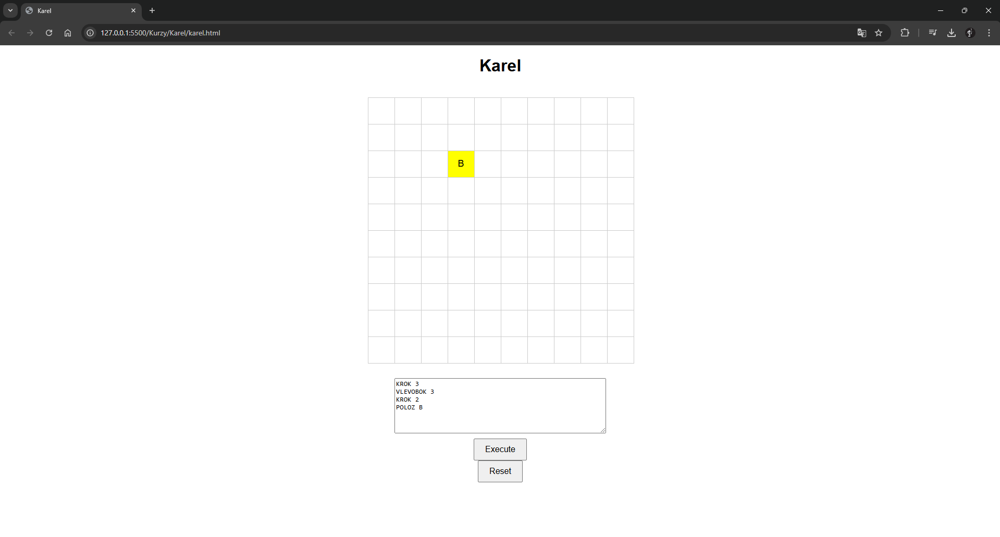

# Karel Game - Dvě Verze

## Přehled

Karel je jednoduchá hra, kde robot "Karel" může vykonávat příkazy na 2D herním poli. Hráči mohou Karla pohybovat, otáčet a umisťovat objekty na herní pole pomocí jednoduchých textových příkazů.

Existují dvě verze tohoto projektu:

1. **Klientská Verze**: Verze, která běží zcela v prohlížeči pomocí HTML, CSS a JavaScriptu.
2. **Serverová Verze**: Verze, kde je herní logika zpracovávána na serveru pomocí PHP a stav hry je komunikován mezi klientem a serverem pomocí HTTP požadavků.

## Funkce

### Dostupné Příkazy

- **KROK [n]**: Posune Karla o `n` kroků vpřed v aktuálním směru. Pokud `n` není uvedeno, Karel se posune o 1 krok.
- **VLEVOBOK [n]**: Otočí Karla doleva o `n` krát. Pokud `n` není uvedeno, Karel se otočí 1krát.
- **POLOZ [X]**: Položí objekt `X` na pozici Karla.
- **RESET**: Resetuje hru, vrátí Karla do levého horního rohu herního pole.

### Klientská Verze (HTML, CSS, JavaScript)

V této verzi běží vše lokálně ve vašem prohlížeči bez potřeby serveru. Herní pole je generováno a příkazy jsou zpracovávány pomocí JavaScriptu.

#### Jak Používat

1. Otevřete soubor `index.html` ve vašem prohlížeči.
2. Zadejte příkazy do textového pole (jeden příkaz na řádku).
3. Klikněte na **Execute** pro vykonání příkazů.
4. Klikněte na **Reset** pro restartování hry.

#### Struktura Projektu

- **index.html**: Hlavní HTML soubor s rozložením hry.
- **style.css**: Styly pro herní pole, vzhled Karla a další.
- **script.js**: JavaScript soubor pro logiku pohybu Karla, otáčení, umisťování objektů a zpracování příkazů.

---

### Serverová Verze (HTML, CSS, PHP)

Tato verze používá server pro zpracování herní logiky. Klient odesílá příkazy na server pomocí HTTP požadavků, server zpracuje příkazy a vrátí aktualizovaný stav hry.

#### Jak Používat

1. Ujistěte se, že máte na svém serveru nainstalovaný PHP.
2. Otevřete soubor `index.php` v prohlížeči a ujistěte se, že je správně nastavený server pro zpracování PHP.
3. Zadejte příkazy do textového pole (jeden příkaz na řádku).
4. Klikněte na **Execute** pro odeslání příkazů na server a vykonání.
5. Klikněte na **Reset** pro resetování hry.

#### Struktura Projektu

- **index.php**: Hlavní HTML soubor, který také komunikuje se serverem přes PHP.
- **style.css**: Styly pro vzhled hry.
- **process.php**: PHP soubor pro zpracování příkazů a komunikaci mezi klientem a serverem.

---

